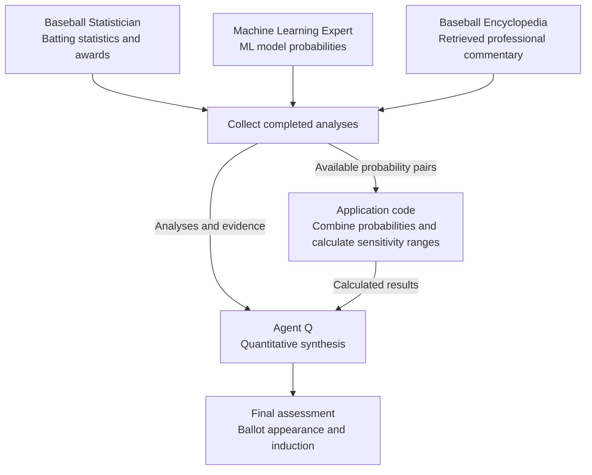

# Baseball AI Workbench

Baseball AI Workbench is a distributed web application for exploring Decision Intelligence through baseball Hall of Fame analysis. It combines historical batting data, in-memory machine learning models, and AI agents to explore rules, probabilities, and what-if scenarios that support human judgment.

**[Try the live demo](https://baseballaiworkbench-dybyfmbvg8hdctds.b02.azurefd.net/)**

## Decision Intelligence

Decision Intelligence connects evidence and analysis to the choices people make. The workbench makes decision criteria explicit, shows uncertainty through probability estimates, and lets users explore how changing assumptions affects a conclusion. Its four scenarios progress from a simple rule to quantitative analysis informed by multiple AI agents.

### Decision Thresholding

A decision threshold connects an observation or probability estimate to a conclusion. A rule can set a threshold on career home runs, while a probability-based assessment can use a cutoff appropriate to the decision and its consequences. Thresholding is a concept across these scenarios; the application uses fixed probability bands to help interpret predictions.

### 1. Rules-Based Analysis

The first scenario predicts Hall of Fame induction using one rule: **career HR ≥ 500 returns True; otherwise, False**. It produces a Boolean result without a machine learning model. Compare the player's actual career with a hypothetical career length: changing the seasons-played slider prorates career totals using season averages and can move the player across the 500-home-run threshold.

### 2. Probability-Based Analysis

The second scenario uses a single ML.NET model to estimate the probability of Hall of Fame induction. Compare the estimate from actual career statistics with the estimate from a hypothetical career length. This shows how changing the evidence affects the probability used to inform a decision.

### 3. Multi-Hierarchy Probabilities

The third scenario examines two stages of the Hall of Fame process: **appearing on the ballot**, then **being inducted**. Separate machine learning models estimate each outcome, helping users distinguish a case for consideration from a case for election. The page displays both probabilities for actual and hypothetical career statistics; it does not calculate a conditional-probability chain.

### 4. Multi-Agent Retrieval

The fourth scenario brings together three AI agents with distinct evidence inputs. Run any agent individually, or select any pair or all three for independently produced analyses followed by Agent Q's quantitative synthesis.

| Agent | Evidence and role |
| --- | --- |
| **Baseball Statistician** | Assesses the selected player's batting statistics and awards to form a statistical perspective on ballot appearance and induction. |
| **Machine Learning Expert** | Interprets probabilities from multiple ML.NET models and their application-calculated averages for both outcomes. |
| **Baseball Encyclopedia** | Retrieves attributed professional commentary and voter opinions through Web IQ, examining agreement, disagreement, and evidence limitations. |
| **Agent Q** | Interprets the completed analyses and the combined probabilities and deterministic sensitivity ranges calculated by application code. |

All three agents are shown; selecting any pair also invokes Agent Q after all selected analyses complete. A single-agent run bypasses Agent Q. Application code performs the calculations, and Agent Q explains them. Sensitivity ranges are not statistical confidence intervals.

The three analysis agents form their conclusions without seeing one another's answers. Their evidence can overlap, so separate analyses do not establish statistical independence. Agent Q explains the quantitative results and remaining uncertainty; the sensitivity ranges are **not statistical confidence intervals**.

## Features

- Historical position-player batting data through the end of the 2025 season.
- Four what-if scenarios, with player search and comparisons of actual and hypothetical career statistics.
- Fast, in-memory predictions using ML.NET models.
- AI agent research and quantitative synthesis using Microsoft Agent Framework and Web IQ.
- Interactive server-side Blazor, orchestrated with Aspire and using SignalR for browser communication.
- Local execution with Docker support and Azure deployment integration.

## Architecture

The cloud deployment combines the Blazor frontend, API service, model inference, AI agents, and Azure services.

## Technology Stack

- **Development:** Visual Studio 2026 or VS Code, .NET 10.x.
- **User interface:** Server-side Blazor and SignalR.
- **Machine learning:** ML.NET v5.x.
- **Application orchestration:** Aspire 13.6.
- **AI agents and retrieval:** Microsoft Agent Framework, Microsoft.Extensions.AI (MEAI), and Web IQ.
- **Model hosting:** Microsoft AI Foundry and Azure OpenAI.
- **Azure delivery:** Azure Container Apps, Azure SignalR, and Azure Front Door.

## Documentation

See the [AppHost configuration and deployment decisions](src/BaseballAIWorkbench/BaseballAIWorkbench.AppHost/README.MD) for AI telemetry, Container Apps sizing and scaling, and Front Door configuration and validation.

## Resources

- [Decision Intelligence](https://www.decisionintelligencebook.ai/)
- [Historical Baseball Statistics Database](http://www.seanlahman.com/baseball-archive/statistics/) — model training and inference data.
- [Microsoft Agent Framework](https://github.com/microsoft/agent-framework/)
- [Microsoft.Extensions.AI (MEAI)](https://learn.microsoft.com/en-us/dotnet/ai/microsoft-extensions-ai/)
- [Aspire](https://aspire.dev/)
- [ML.NET](https://dotnet.microsoft.com/apps/machinelearning-ai/ml-dotnet)
- [Blazor](https://dotnet.microsoft.com/apps/aspnet/web-apps/blazor)
- [Web IQ](https://webiq.microsoft.ai/)
